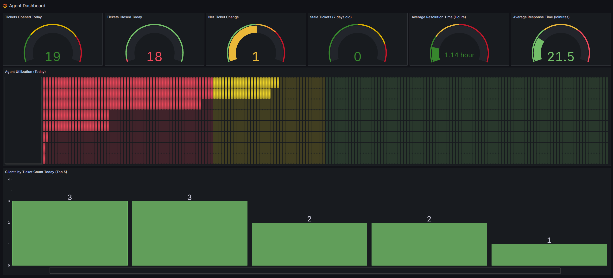

# Grafana Dashboards

This section contains comprehensive Grafana dashboard configurations and documentation for HaloPSA monitoring and analytics. These dashboards provide real-time insights into your MSP operations, agent performance, and client metrics.

## Prerequisites

Before implementing any dashboards in this section, ensure you have:

### Grafana Setup
- **Grafana Instance** - A working Grafana installation
- **Infinity Data Source Plugin** - Required for HaloPSA API integration
- **HaloPSA API Access** - Valid API credentials with appropriate permissions

### Infinity Plugin Configuration

The dashboards in this section rely on the Infinity Data Source plugin for connecting to HaloPSA's API. 

#### Installation Steps
1. **Install the Plugin**
   - Navigate to: Administration > Plugins and Data > Plugins
   - Search for "Infinity" in the search bar
   - Click the Infinity tile, then click Install

2. **Setup HaloPSA Credentials**
   - Log into HaloPSA as an admin
   - Navigate to: Configuration > Integrations > HaloPSA API
   - Note the Resource Server URL, Authorization Server URL, and Tenant Name
   - Create a new Application with "Client ID and Secret (Services)" authentication
   - Copy the Client ID and Client Secret (save securely - shown only once)

3. **Set API Permissions**
   - Grant minimum required permissions: `read:tickets`, `read:assets`, `read:customers`, `read:contracts`
   - Add additional permissions like `edit:tickets` if needed for future functionality

4. **Configure Data Source**
   - In Grafana: Connections > Add new connection
   - Search for "Infinity" and select it
   - Configure with your HaloPSA API details using OAuth 2.0 authentication

## Available Dashboards

### [Agent Dashboard](agent-dashboard.md)
**Comprehensive agent performance monitoring and analytics**

This dashboard provides real-time insights into:
- **Daily Ticket Metrics** - Opened, closed, and net ticket changes
- **Performance Analytics** - Resolution times and response times
- **Agent Utilization** - Daily productivity and workload distribution
- **Client Activity** - Top clients by ticket volume
- **Stale Ticket Monitoring** - Tickets older than 7 days

**Technical Requirements:**
- HaloPSA API endpoints: `/Tickets`, `/Agent`, `/TimesheetEvent`, `/Actions`
- Infinity Data Source with OAuth 2.0 configuration
- JSONata expressions for advanced data transformation

## Dashboard Features

### Real-Time Monitoring
- **Live Data Updates** - 30-second refresh intervals
- **Current Day Focus** - Optimized for daily operational insights
- **Performance Metrics** - KPIs critical for MSP operations

### MSP-Optimized Visualizations
- **Gauge Panels** - Quick status indicators for key metrics
- **Bar Charts** - Client and agent comparison data
- **Threshold Alerts** - Visual indicators for performance targets

### Customizable Components
- **Flexible Time Ranges** - Adjustable for different operational needs
- **Configurable Thresholds** - Customizable performance targets
- **Modular Design** - Easy to modify or extend with additional panels

## Implementation Notes

### API Considerations
- **Rate Limiting** - Dashboards respect HaloPSA API rate limits
- **Authentication** - Secure OAuth 2.0 token management
- **Error Handling** - Graceful handling of API connectivity issues

### Performance Optimization
- **Efficient Queries** - Optimized API calls to minimize load
- **Caching Strategy** - Appropriate refresh intervals for different data types
- **Resource Management** - Balanced between real-time data and system performance

## Troubleshooting

### Common Issues
1. **No Data Displayed**
   - Verify Infinity data source configuration
   - Check HaloPSA API credentials and permissions
   - Confirm API endpoint accessibility

2. **Authentication Errors**
   - Validate OAuth 2.0 configuration
   - Verify Client ID and Secret
   - Check API permission scopes

3. **Performance Issues**
   - Review query complexity and data volume
   - Adjust refresh intervals if needed
   - Monitor HaloPSA API rate limits

## Future Dashboards

Additional dashboards are planned for:
- **Client Performance Dashboard** - Client-specific metrics and SLA tracking
- **Financial Analytics Dashboard** - Billing and profitability insights
- **Service Level Dashboard** - SLA compliance and performance tracking
- **Capacity Planning Dashboard** - Resource utilization and growth projections

## Support Resources

- **Grafana Documentation** - Official Grafana setup and configuration guides
- **Infinity Plugin Documentation** - Plugin-specific configuration and troubleshooting
- **HaloPSA API Documentation** - API endpoint specifications and authentication
- **JSONata Documentation** - Data transformation expression syntax

---

*These dashboards represent production-tested configurations used in real MSP environments. They demonstrate practical applications of HaloPSA API integration for business intelligence and operational monitoring.*
